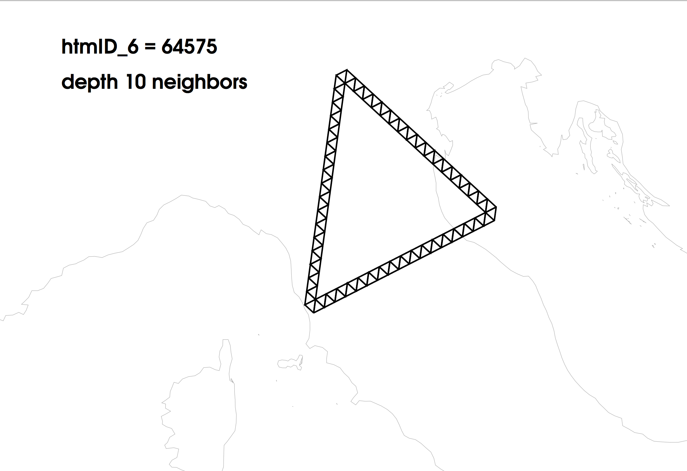

# Table of Contents
1. [Introduction](#introduction)
    1. [What’s new in version 0.5.5](#whats-new-in-version-055)
    2. [What’s new in version 0.5.4](#whats-new-in-version-054)
    3. [What’s new in version 0.5.3](#whats-new-in-version-053)
    4. [A simple example](#a-simple-example)
2. [The HEALPix and HTM pixelization schemas](#the-healpix-and-htm-pixelization-schemas)
    1. [Index choice](#index-choice)
3. [DIF installation](#dif-installation)
    1. [Dependencies](#dependencies)
    2. [Installing DIF](#installing-dif)
    3. [Upgrade](#upgrade)
4. [How DIF works](#how-dif-works)
    1. [The search criteria](#the-search-criteria)
    2. [DIF.tbl and DIF.func tables](#diftbl-and-diffunc-tables)
    3. [Structure of the DIF.dif table](#structure-of-the-difdif-table)
5. [DIF usage](#dif-usage)
    1. [dif options](#dif-options)
6. [Indexing a table using DIF](#indexing-a-table-using-dif)
    1. [Accessing indexed tables](#accessing-indexed-tables)
    2. [Drop a DIF index from a table](#drop-a-dif-index-from-a-table)
    3. [Uninstalling DIF from MySQL database](#uninstalling-dif-from-mysql-database)
7. [Benchmarks and guidelines for using DIF](#benchmarks-and-guidelines-for-using-dif)
8. [DIF functions reference](#dif-functions-reference)
    1. [Wrapper to function in the HTM library](#wrapper-to-function-in-the-htm-library)
    2. [Wrapper to function in the HEALPix library](#wrapper-to-function-in-the-healpix-library)
    3. [DB engine-related functions: region selections](#db-engine-related-functions-region-selections)
    4. [DB engine-related functions: auxiliary functions](#db-engine-related-functions-auxiliary-functions)
    5. [Utility fnctions](#utility-functions)
9. [Generating fake sky tables](#generating-fake-sky-tables)
10. [Entries cross-matching](#entries-cross-matching)
11. [Troubleshooting](#troubleshooting)

## Introduction

Typically DB server offer efficient indexing of one or more 1–d data
using the so called B–tree structure. Data produced by an astronomical
experiment however are typically related to sky coordinates which span a
2–d space. Although it is possible to index such data using one or two
simultaneous 1–d indexes like RA and Dec, the queries performance will
be very poor since the search criteria on a 2–d space can be much more
complex than on an union of two independent 1–d spaces. Indeed the only
possible queries that take advantages of such indexes will involve range
checking along the two coordinates: &alpha;<sub>1</sub> &le; &alpha; &le; &alpha;<sub>2</sub>
and &delta;<sub>1</sub> &le; &delta; &le; &delta;<sub>2</sub>. In some cases,
the DB server provides built-in capabilities to manage 2–d coordinates
into indexes using the R–tree
structure. This would allow search criteria like “Find all objects
within 2 arcsec of a given location”. However these functionalities are
far from being a standardized feature of DB servers; furthermore, there
is room for optimization and specialization for astronomical usage.

**DIF** is a set of tools aimed at implementing a powerful indexing
system for astronomical catalogues, or any other table containing
spherical coordinates, stored into MySQL databases. It uses a sphere
pixelization scheme to convert a latitude/longitude coordinate system
into a single pixel ID, and creates a B–tree (1–d) index on it.
Furthermore it provides a number of functions to generate the pixel IDs
given a search criteria such as “Find all the objects within a given
cone”. This way it allows very fast queries execution even on
billion-rows tables, using the MySQL built-in indexing system.
**DIF** provides two pixelization schemas: [HTM][1] and [HEALPix][2]
(with either RING or NESTED map ordering). **DIF** software and
documentation is distributed as an open source package under the GPL
license at the site <http://ross.iasfbo.inaf.it/MCS/>. Please note that
though tested and operational, this package is continuosly updated and
relevant changes could affect new versions. Please keep checking the web
site. Should you find any bug or inconsistency, or if you wish to
suggest new features and/or contribute to the development, please write
us at:

-   Giorgio Calderone _giorgio.calderone@inaf.it_

-   Luciano Nicastro _luciano.nicastro@inaf.it_

This document is organized as follows: § [pixel schema](#the-healpix-and-htm-pixelization-schemas) provides an
overview of the HTM and HEALPix pixelization schemas. Section [install](#dif-installation)
shows how to install **DIF**, whereas § [usage](#dif-usage) shows how to
use it. § [how it works](#how-dif-works) describes **DIF** internals and
§ [benchmarks](#benchmarks-and-guidelines-for-using-dif) provides some guidelines on how to reach good performance
in queries excecution. Finally § [DIF functions reference](#dif-functions-reference)
provides the reference to all the **DIF** related functions.

### What’s new in version 0.5.5

As of DIF version 0.5.5, you do not need to compile and install the MySQL
source version anymore. It's enough to get the source code and, eventually,
execute a `cmake` configuration. See below.

Some of the changes/additions listed were already introduced in later 0.5.4 versions.

- Ported to GitHub.

- Various changes in order to allow installation with MariaDB 10.3 binary version.

- Various changes in order to allow:
    - installation using only the binary version of MySQL (same version as the system installed version)
    - compatibility with MySQL 8

- Code cleaning / additions.

- Added support for MySQL > 5.7.9 and MariaDB > 10.1

- Changed `DIF.tbl` column definitions.

- Added RAcol and DECcol SQL functions.

- Added sub dif\_update in dif script.

- Added --ra-key option to dif script.

- Added getRaDec and RADECcol SQL functions.

To Be Continued

### What’s new in version 0.5.4

- Replaced HEALPix C++ library with version 3.30.

- Added rectangular region selections for HEALPix indexed tables.

- Added `HEALPBound` and `HEALPBoundC` UDFs.

- Added `difview_htmClean`, `difview_healpClean`, `difview_Check` and
  `difInfo` SQL procedures.

- Added `DIF.func` table.

- The `dif` script uses new default settings and has more options and
  commands. In particular, as root, it is possible to grant minimal
  privileges to users in order to be able to manage specific DBs. See
  `dif -h`.

- Code cleaning.

- Documentation updated.

### What’s new in version 0.5.3

- Works also for MySQL 5.6 and 5.7 (and MySQL Cluster 7.2 and MariaDB
  10.0, 10.1).

- Use memset instead of bzero.

- Added UDF `HTMsNeighb` and DIF function `DIF_sNeighb` to get higher
  depth trixels around a given trixel.

- `dif` script update with additional options (see `dif -h`).

- Documentation updated.

### A simple example

Once **DIF** is installed (see section [install](#dif-installation)) a database named
`DIF` will be created, with a test table named `Messier` in it. This
table simply contains the Messier catalogue of astronomical objects. Its
purpose is to test **DIF** functionalities before using it to real
data tables. The equatorial coordinates in degrees of each object are
stored in the `Ra` and `Decl` fields (note that MySQL does not allow
to have an “unquoted” field named `Dec` because it is a reserved word
– it is a synonym for `DECIMAL`). To create a HTM index with depth 6
(see § [pixelization schemas](#the-healpix-and-htm-pixelization-schemas))
simply issue the command:

      dif --index-htm DIF Messier 6 Ra Decl

Now you can query the DB server requesting, for example, all the objects
in the catalogue within 100 arcmin from the point with Ra = 82&deg;,
Dec = 22&deg;:

```sql
    mysql> SELECT * FROM Messier_htm_6 WHERE DIF_Circle(82, 22, 100);
    +---+------+-------+------+--------+---------+---------+---------+-----------+--------+
    | M | Type | Const | Mag  | Ra     | Decl    | Dist    | htmID_6 | HTM_Depth |HTM_Full|
    +---+------+-------+------+--------+---------+---------+---------+-----------+--------+
    | 1 | BN   | Tau   |  8.2 | 83.625 | 22.0167 | 6.3 kly |   62340 |         6 |       0|
    +---+------+-------+------+--------+---------+---------+---------+-----------+--------+
    1 row in set (0.00 sec)
```

## The HEALPix and HTM pixelization schemas

The HEALPix pixelization scheme (Górski et al., ApJ 662, 759, 2005) uses
equal-area pseudo-square pixels, particularly suitable for spatial
analysis. The base pixels are 12 with two different shapes
([Fig. 1](#sphe-pix-schema)). The region in the range &minus;2/3 < z < 2/3 is referred as
the equatorial zone, the two remaining regions being the polar caps.
Recursive subdivision of these pixels is performed keeping their centers
equally distributed along rings of constant colatitude. Rings located in
the equatorial zone are divided into the same number of pixels; the
remaining rings contain a varying number of pixels. The two rings
closest to the poles always have 4 pixels and going toward the equator
the number of pixels increases by 4 at each step. The resolution of the
HEALPix grid is parameterized by N<sub>side</sub> = 2<sup>k</sup> , where *k* assumes
integer values being 0 for the base pixelization. It is called the
“resolution parameter” or *order*. It is then
N<sub>pix</sub> = 12 &times; N<sub>side</sub><sup>2</sup>. The HEALPix library implements
a recursive quad-tree pixel subdivision which is naturally nested. The
resulting pixel numbering scheme is then referred as the *nested*
scheme. Alternatively the *ring* scheme simply counts the pixels moving
down from the north to the south pole along each isolatitude ring (see
[Fig. 1](#sphe-pix-schema)). The usage of the ring scheme is not recommended to
index tables like object catalogues which are typically queried on small
sky regions. In fact in this case a pixel ID-bind data sorting will not
result into an efficient “grouping” like that obtainable for the nested
scheme where to “close-on-sky” pixels correspond “close-on-disk” data.
This is an important issue because data seek time is the main issue to
face when dealing with very large tables.

The HTM sphere pixelization scheme (Kunszt et al., 2001) uses triangular
pixels which can recursively be subdivided into four pixels. The base
pixels are 8. They are obtained by the intersection on the sphere of 3
major big circles. On the Earth they can be represented by the equator
and two meridians passing at longitude 0&deg; and 90&deg; (see
[Fig. 1](#sphe-pix-schema)). These base spherical triangles all have the same area.
Each of them can then be further divided into four spherical triangles,
or *trixels*, by connecting the three sides middle points using great
circle segments. As can be seen from [Fig. 1](#sphe-pix-schema), from the first
subdivision onward the resulting trixels are no longer equal-area. The
scatter of the trixels area remains within the &plusmn;70% of the mean
area, which is 2&pi;/4<sup>d+1</sup> , being *d* the *depth* or level (step of
recursive subdivision) of the trixel. For a given depth the number of
trixels is N<sub>pix</sub> = 8 &times; 4<sup>d</sup> . The minimal side length is
&pi;/2<sup>d+1</sup> and the maximal is &#8771;&pi;/2 times the minimal length.

The relevant parameters for the two pixelizations are reported in the
following table.


|   | **HTM** | **HEALPix** |
|:--|:--------|:------------|
| N<sub>pix</sub>&dagger;: | 8 &times; 4<sup>d</sup>  |  12 &times; N<sub>side</sub><sup>2</sup> (where N<sub>side</sub> = 2<sup>k</sup> ) |
| ID range: | [N<sub>pix</sub> , 2 &times; N<sub>pix</sub> - 1]  |  [0 , N<sub>pix</sub> - 1] |
| Max N<sub>pix</sub>: | &#8771; 9.0 &times; 10<sup>15</sup>   |  &#8771; 3.5 &times; 10<sup>18</sup> |
| Max res.\* (&prime;&prime;): | &#8771; 1&times; 10<sup>-2</sup>  |  &#8771; 4&times; 10<sup>-4</sup> (&Omega;<sub>pix</sub> = &pi;/(3 &times; N<sub>side</sub><sup>2</sup> )) |

&dagger; d (depth): [0 , 25]; k (order <=> resolution parameter): [0 , 29]<br />
\* For HTM the maximum resolution is derived from the trixel minimum side, for HEALPix assuming a square-pixel equivalent area.

<a name="sphe-pix-schema"></a>

Figure 1: (*left*) The 12 HEALPix base pixels color coded for the “ring” scheme on the plane and
the sphere. Over-plotted the pixel boundaries for `k = 1` which gives 48 pixels. (*right*) The 8 HTM
base pixels and recursive subdivisions on Earth surface. The “depth” d of the trixels is marked.


We, in general, suggest to prefer the HTM pixelization because it offers
a larger set of functions with respect to HEALPix. We’ll see below that
the HEALPix IDs of any set of selected rows can still be computed using
the DIF functions at query execution time.

### Index choice

As said, there are two pixelization schema available in **DIF**: HTM
and HEALPix. Users can choose to use one of them or both. For catalogues
and other general purpose applications, HTM is usually the best choice
because more reliable search criteria are available for not circular
regions. In order to use **DIF** on a table, the user must provide
the following information to the `dif` script:

-   database name;

-   table name;

-   depth/order of the pixelization scheme:

    -   HTM, depth [0:25];

    -   HEALPix, resolution parameter: [0:29], for either ordering
        scheme (RING or NESTED, see below);

-   the two field names corresponding to the spherical coordinates (e.g.
    RA and Dec, longitude – &phi; and latitude – &theta;) *or* a SQL
    compatible expression to compute them.

**Note:** starting from Ver. 0.3.3-alpha1 the maximum resolution
parameter for HEALPix is **29** (it was 13 due to the use of 32 bit
integers) corresponding to an angular resolution of
&sim; 4 &times; 10<sup>-4</sup> arcsec. However, because of 64-bit floating point
arithmetics limitations (e.g. minimum appreciable angular distance),
this limit is not applicable for all the **DIF** implemented functions.

**Note:** as Ver. 0.5.4 it is no more required to be root to run `dif`.
`dif --grant-user` can be used to grant management permissions on all
tables in a particular DB to a given user. The resolution of the
pixelization scheme is an important parameter that will affect the speed
at which queries are executed. Test performed on very large tables have
shown that it is not always true that the greater is the depth the
faster will be the query execution. The query execution time is the
result of a number of operations which depend on several system
parameters. Our results suggest that the most imortant component is the
disk seek/access time and that the CPU usage is a negligible fraction of
the total time. We also found that for tables up to several billion
rows, the HTM pixelization at depth 8 gives the best performance[^3]
(see also § [benchmarks](#benchmarks-and-guidelines-for-using-dif)).
This result could be system dependent but we
believe that typically having pixels of size &sim; 20&prime; is a good
choice. For large tables this means that it is adviceble having on
average a few thousand entries per pixel. However the user should make
his/her own tests and choose the most appropriate depth/order. He/she
should also consider if it is worth creating an index on one of the
coordinates in conjuction with the IDs, i.e. for the HTM case,
`htmID-RA`. From our experience, the use of this two-levels index
together with a “data” sorting (e.g. via `myisamchk -R` for `MyISAM`
tables) could reduce the
query execution time by up to one order of magnitude for very large
tables. Note also that in this case the **DIF** created index on
`htmID` (only) can be dropped as MySQL/DIF will use the new one
automatically being the pixelization ID the first element of the new
aggregate index. An example is:

```sql
    mysql> DROP INDEX htmID_8 ON MyDB.MyTable;
    mysql> CREATE INDEX htmID_8 ON MyDB.MyTable (htmID_8, RA);
```

The table below shows the number of pixels and memory requirements associated to different
levels of resolution parameter for HTM (*depth*) and HEALPix (*order*).

| **Depth**/**Order**  |  **Nside**  |  **HTM** Npix  |  **HEALPix** Npix  |  **Bytes**  |  **Data type**  |
|-------:|--------------:|-------------------------:|--------------------------------:|-------|-----------|
|    0   |            1  |                       8  |                          12     |   1   |  TINYINT  |
|    1   |            2  |                      32  |                          48     |   1   |  TINYINT  |
|    2   |            4  |                     128  |                         192     |   1   |  TINYINT  |
|    3   |            8  |                     512  |                         768     |   2   | SMALLINT  |
|    4   |           16  |                   2,048  |                       3,072     |   2   | SMALLINT  |
|    5   |           32  |                   8,192  |                      12,288     |   2   | SMALLINT  |
|    6   |           64  |                  32,768  |                      49,152     |   2   | SMALLINT  |
|    7   |          128  |                 131,072  |                     196,608     |   3   | MEDIUMINT  |
|    8   |          256  |                 524,288  |                     786,432     |   3   | MEDIUMINT  |
|    9   |          512  |               2,097,152  |                   3,145,728     |   3   | MEDIUMINT  |
|   10   |        1,024  |               8,388,608  |                  12,582,912     |   3   | MEDIUMINT  |
|   11   |        2,048  |              33,554,432  |                  50,331,648     |   4   |  INTEGER  |
|   12   |        4,096  |             134,217,728  |                 201,326,592     |   4   |  INTEGER  |
|   13   |        8,192  |             536,870,912  |                 805,306,368     |   4   |  INTEGER  |
|   14   |       16,384  |           2,147,483,648  |               3,221,225,472     |   4   |  INTEGER  |
|   15   |       32,768  |           8,589,934,592  |              12,884,901,888     |   5   |  BIGINT  |
|   16   |       65,536  |          34,359,738,368  |              51,539,607,552     |   5   |  BIGINT  |
|   17   |      131,072  |         137,438,953,472  |             206,158,430,208     |   5   |  BIGINT  |
|   18   |      262,144  |         549,755,813,888  |             824,633,720,832     |   5   |  BIGINT  |
|   19   |      524,288  |       2,199,023,255,552  |           3,298,534,883,328     |   6   |  BIGINT  |
|   20   |    1,048,576  |       8,796,093,022,208  |          13,194,139,533,312     |   6   |  BIGINT  |
|   21   |    2,097,152  |      35,184,372,088,832  |          52,776,558,133,248     |   6   |  BIGINT  |
|   22   |    4,194,304  |     140,737,488,355,328  |         211,106,232,532,992     |   6   |  BIGINT  |
|   23   |    8,388,608  |     562,949,953,421,312  |         844,424,930,131,968     |   7   |  BIGINT  |
|   24   |   16,777,216  |   2,251,799,813,685,250  |       3,377,699,720,527,872     |   7   |  BIGINT  |
|   25   |   33,554,432  |   9,007,199,254,740,990  |      13,510,798,882,111,488     |   7   |  BIGINT  |
|   26   |   67,108,864  |                          |      54,043,195,528,445,952     |   7   |  BIGINT  |
|   27   |  134,217,728  |                          |     216,172,782,113,783,808     |   8   |  BIGINT  |
|   28   |  268,435,456  |                          |     864,691,128,455,135,232     |   8   |  BIGINT  |
|   29   |  536,870,912  |                          |   3,458,764,513,820,540,928     |   8   |  BIGINT  |


## DIF installation

The **DIF** software library is distributed in a `tar.gz` package (e.g. from
<http://ross.iasfbo.inaf.it/dif/>) but can also be downloaded from the
[GitHub repository](https://github.com/lnicastro/DIF). To unpack the package
simply issue the command:

      tar xvzf dif-x.y.z.tar.gz

where `x`, `y`, `z` are the version number (namely the first number is
the major revision, the second number is the version, and third number
is the subversion). A directory named `dif-x.y.z` will be created
containing all the source code as well as the documentation and the
scripts needed to install **DIF**.
To download and manage the package via the GitHub repository you need `git`:

      git clone https://github.com/lnicastro/DIF.git
      cd DIF

Before installing **DIF** you
should check that all the mandatory dependencies are satisfied (see
§ [dependencies](#dependencies)), then you should follow the procedure described
in [section below](#installing-dif).

### Dependencies

The mandatory packages required by **DIF** are:

-   MySQL (`http://dev.mysql.com/downloads/`, version 5.1.30 or later)
    or
    MariaDB (`https://downloads.mariadb.org/`, version 10.0 or newer);

-   Perl (`http://www.perl.com/`);

-   The `DBD::mysql` Perl module.

**Note:** MySQL source code is necessary, not just the compiled package.
The `DBD::mysql` Perl module can be easily installed through the `cpan`
utility issuing the following command:

      install DBD::mysql

See the `cpan` documentation for further information. If these package
are not already installed in the system you should install them before
continuing.

### Installing DIF

To install **DIF** you should follow the usual `configure`, `make`,
`make install` procedures:

-   configuring **DIF** means checking your system for
    compatibilities, search for include files and libraries, and finally
    produce all necessary s needed to compile the **DIF** sources.
    This is done automatically by the distributed `configure` script.
    Typically you should only provide one argument to the `configure`
    script, as follows:

          ./configure --with-mysql-source=<PATH>

    where `<PATH>` is the absolute path to the MySQL source tree. The
    `configure` script has a lot of options and switches (type
    `configure --help` for a list) to customize the compilation step.
    For further documentation see the `INSTALL` file. Nevertheless we
    recommend not to change the default installation path (i.e. the
    `--prefix=` option).

-   once the `configure` script has been correctly executed the
    compilation of sources is performed with the command:

          make

    If you got errors while compiling check the configuration process
    and the `INSTALL` file.

-   once sources are compiled you can install the libraries and the
    scripts with the command:

          make install

    Usually this command need to be executed as “root”. In some cases it
    may be helpful to execute the `ldconfig` command (as “root”) to
    rebuild the shared library cache.

-   finally, to install the DB engine and the **DIF** facilities you
    should issue the command (a running MySQL server is required!):

          dif --install

    The password of MySQL “root” user will be required. Optionally you
    could use the `--log` option to get more information about SQL
    queries being executed.

### Upgrade

After you have compiled and installed a new version of **DIF** you
do not need to issue a `dif --install` but rather

      dif --upgrade

to upgrade UDFs and view definition. In case you are using a very old
version of **DIF** (&le; 0.3.3) please contact us and we will try
to help you in this process. Since version 0.5.3, you can eventually use
another, partially manual way to upgrade:

1.  open a MySQL session as root and issue these commands:

          create table test.tbl select * from DIF.tbl;
          delete from DIF.tbl;

    eventually issue similar commands for other tables you may have in
    `DIF` (like `Messier`).

2.  uninstall and reinstall **DIF**:

          dif --uninstall
          dif --install

    Eventually please see also section [troubles](#troubleshooting). In particular
    after the `uninstall` consider restarting the MySQL server.

3.  in MySQL restore the `DIF.tbl` table (and eventually more).

          insert into DIF.tbl select * from test.tbl;
          drop table test.tbl;

    Can view the content of the table, just in case:

```sql
          select * from DIF.tbl;
```

If, for any reason, a **DIF** view was lost or is inconsistent with
the content of `DIF.tbl`, you can recrate it with the option
`--views-only` to `dif`. For example let’s assume you have installed the
Messier catalogue (in `DIF`, see [section below](#how-dif-works)) and want to
recreate it:

      dif --views-only --index-htm DIF Messier 6 Ra Decl

This can be done for any table listed in `DIF.tbl`.

## How DIF works

Consider an astronomical catalog stored on a database table in which
each entry has two fields in which the coordinates of a
latitude/longitude system are stored. The **DIF** approach is to
split the sphere into a finite number of zones (or “pixels”) and
associate an ID to each of these pixels. The association is based on one
of the pixelization schemas described in
§ [pixel schemas](#the-healpix-and-htm-pixelization-schemas). Thus a
pixel ID can be associated to each entry in the table. **DIF** will
add a field to the table to store such IDs and creates an index on it,
relaying on the built-in MySQL indexing system. Then
**DIF** provides a way to dynamically generate a list of pixel IDs
corresponding to a given search criteria, and perform a SQL join between
the indexed table and the pixel list, thus providing very fast query
execution. The pixel ID list is provided through the `DIF.dif` table;
this is not a usual table since it does not occupy any space on the
disk, its content is dynamically generated based on the user specified
search criteria. This functionality is provided by the **DIF** DB
engine. The generation of the pixel ID list and the SQL join are
completely transparent to the user once the **DIF** views are used
to access the table. In the following example we will refer to the
`Messier` table which is automatically installed in the `DIF`
database during **DIF** installation. Other astronomical tables with
many more entries can be downloaded from
<http://ross.iasfbo.inaf.it/MCS/>. The `Messier` table has the following
structure:

```sql
    mysql> describe Messier;
    +----------+----------------------+------+-----+---------+-------+
    | Field    | Type                 | Null | Key | Default | Extra |
    +----------+----------------------+------+-----+---------+-------+
    | M        | int(11)              | NO   |     | NULL    |       |
    | Type     | char(2)              | YES  |     | **      |       |
    | Const    | char(3)              | YES  |     | ***     |       |
    | Mag      | float                | YES  |     | NULL    |       |
    | Ra       | float                | YES  |     | NULL    |       |
    | Decl     | float                | YES  |     | NULL    |       |
    | Dist     | char(20)             | YES  |     | NULL    |       |
    | App_size | char(20)             | YES  |     | unknown |       |
    +----------+----------------------+------+-----+---------+-------+
```

The equatorial coordinates in degrees of each object is stored in the
[Ra] and [Decl] fields. Any other coordinate system can be used as
well, provided it can be transformed to a latitude ([-90:90]) /
longitude ([0:360]) spherical system. To use the **DIF** indexing
system upon this table we should issue a command like:

      dif --index-htm DIF Messier 6 Ra Decl

In this case the HTM pixelization scheme with depth 6 is used. Note that
we passed the name of the fields containing the coordinates in the
command line. The `dif` script will:

-   add a new field named `htmID_6` (of type [smallint]) to the
    table and populate it with the HTM ID corresponding to the
    coordinates of the object;

-   create an index on `htmID_6`;

-   create a view named `Messier_htm_6` which trasparently perform
    the join between the `Messier` and [DIF.dif] table;

-   define triggers so that the `htmID_6` field will be automatically
    populated with the correct HTM ID each time the `Messier` table
    is modified.

Now the user can access the indexed table through the
`Messier_htm_6` view. The search criteria are specified in the
`SELECT` query using the `DIF\_Circle` (or another region-defining)
function as in the example shown below. <br />
*Note:* from V. 0.5.2 the prefix `HTM/HEALP` has been removed from these
functions as the pixelization scheme is derived directly from the *view* used.

```sql
    mysql> SELECT * FROM Messier_htm_6 WHERE DIF_Circle(82, 22, 100);
    +---+------+-------+------+--------+---------+---------+---------+-----------+--------+
    | M | Type | Const | Mag  | Ra     | Decl    | Dist    | htmID_6 | HTM_Depth |HTM_Full|
    +---+------+-------+------+--------+---------+---------+---------+-----------+--------+
    | 1 | BN   | Tau   |  8.2 | 83.625 | 22.0167 | 6.3 kly |   62340 |         6 |       0|
    +---+------+-------+------+--------+---------+---------+---------+-----------+--------+
    1 row in set (0.00 sec)
```

Although the table used in the example has only 110 records, the notable
aspect here is that with **DIF** the same query can be executed even
on a table with several billions records and the execution time will be
approximately the same for any table, provided the index has been chosen
carefully (see § [benchmarks](#benchmarks-and-guidelines-for-using-dif)).
A schematic view of the entire process is show in the following [Fig. 2](#dif-query-schema).


Figure 2: Schematic view of the tables involved in a DIF query.

In many cases using one single index would suffice all the user’s needs.
However any number and type of **DIF** indices can be added to the
table. Depending on the system requirements, this could positively
affect the overall performance. How many and which type of indices one
should use, typically depends on the number of entries in the table and
the (range of) size of the sky regions queried. We will discuss this
below, but we also recommend to read the reference paper “*Nicastro and
Calderone, AA, vol. 2010, ID 524534*”. Thus a user may want, e.g., to
add also a HTM index of depth 8 and an HEALPix nested index of order 10;
this is easily done with the command:

      dif --index-htm DIF Messier 8 Ra Decl \
          --index-healpix-nested DIF Messier 10 Ra Decl

Because an additional HTM depth is present, an “aggregate” view
`Messier_htm` will be created. Users should perform the query on the
view corresponding to the index to be used, in this case
`Messier_htm_6`, `Messier_htm_8` or
`Messier_healp_nest_10`. Optionally, to use simultaneously the two
HTM indices 6 and 8, one can query the view `Messier_htm`. It uses
`UNION ALL` statements to perform the query on all the available
depths and return a single list of entries. Note, however, that
**DIF** performs a single call to the HTM routine to get the list of
IDs at the various depths by performing a “recursive erosion” of the
queried region (see the above cited reference paper). These IDs are then
used to feed the `DIF.dif` table as in the single depth case (see
below).

### The search criteria

The search criteria used to dynamically populate the `DIF.dif` table
are specified through one of the following functions:

-   DIF\_Circle: circle (cone) region;

-   DIF\_Rect: rectangular region giving sides;

-   DIF\_Rectv: rectangular region giving vertices;

-   DIF\_NeighbC: region of a central pixel and its neighbors.

-   DIF\_sNeighb: region of neighbors at higher depth (smaller
    pixel) around a central pixel. *Only implemented for HTM
    pixelization.* See e.g. [Fig. 3](#htm-neighb).

**Note:** starting from Ver. 0.5.2 the prefix `HTM/HEALP`, used to
identify the functions that apply to the two types of pixelizations,
have been dropped. In fact these functions now inherit the information
on the pixelization directly from the views they apply to. The
parameters of such functions are described in
§ [functions reference](#dif-functions-reference). **DIF** will remember search
criteria between successive queries until a new search criteria is
specified. Thus, assuming these indices exist, the following queries
will return exactly the same set of records:

```sql
      SELECT * FROM Messier_htm_6 WHERE DIF_Circle(82, 22, 100);
      SELECT * FROM Messier_htm_8;
      SELECT * FROM Messier_htm;
      SELECT * FROM Messier_healp_nest_10;
```

Indeed the only difference may be in the queries execution times since
different indexes could provide different performance. Furthermore,
search criteria may be specified before accessing the view, as in the
following example:

```sql
      SELECT DIF_Circle(82, 22, 100);
      SELECT * FROM Messier_htm_6;
```

**Note:** future versions of **DIF** will eventually allow combining
(through logical AND and OR) different regions. However this will
require to drop the creation (and then availability) of the aggregate
view (`_htm`). We then suggest to use in the queries only the depth
specific views to avoid the need to change program and scripts code in
the future.

<a name="htm-neighb"></a>

Figure 3: Earth view of the HTM depth 10 neighbors to the depth 6 trixel with
ID 64575 (covering Bologna [lon, lat] ≃ [11, 44]). This selection can be done
via the UDF function `HTMsNeighb` or via `sNeighb` in a DIF query (see below).


### `DIF.tbl` and `DIF.func` tables

The `DIF.tbl` table is used to store the basic information about the
tables being handled by **DIF**. Its structure is:

```sql
    mysql> describe DIF.tbl;
    +-----------+--------------+------+-----+---------+-------+
    | Field     | Type         | Null | Key | Default | Extra |
    +-----------+--------------+------+-----+---------+-------+
    | db        | varchar(64)  | YES  | MUL | NULL    |       |
    | name      | varchar(128) | YES  |     | NULL    |       |
    | id_type   | int(11)      | NO   |     | NULL    |       |
    | id_opt    | int(11)      | NO   |     | 0       |       |
    | param     | int(11)      | NO   |     | NULL    |       |
    | Ra_field  | varchar(128) | YES  |     | NULL    |       |
    | Dec_field | varchar(128) | YES  |     | NULL    |       |
    +-----------+--------------+------+-----+---------+-------+
```

**Note:** the string (`varchar`) fields were extended in v. 0.5.4.

The `DIF.func` table is used to store information about
**DIF** functions and procedures. It is used by the `difInfo` SQL
procedure. Its structure is:

```sql
    mysql> describe DIF.func;
    +-------------+------------------------------------------+------+-----+-----------+
    | Field       | Type                                     | Null | Key | Default   |
    +-------------+------------------------------------------+------+-----+-----------+
    | name        | char(64)                                 | YES  |     | unknown   |
    | params      | varchar(128)                             | YES  |     | undefined |
    | ret         | char(16)                                 | YES  |     | string    |
    | type        | enum('function','procedure','aggregate') | YES  |     | NULL      |
    | plugin_lib  | char(64)                                 | YES  |     |           |
    | description | varchar(256)                             | YES  |     |           |
    +-------------+------------------------------------------+------+-----+-----------+
```

**Note:** this table was added in v. 0.5.4.

### Structure of the `DIF.dif` table

The `DIF.dif` table is the core of the **DIF** since it provides
the (either HTM or HEALpix) pixel list IDs against which indexed table
are to be joined, based on user search criteria. It also reports if a
given pixel is fully or partially included in the requested region. The
`dif` table is based on the **DIF** database engine, thus it is
different from other database tables since it doesn’t occupy any space
on disk but its content is dynamically generated using the
**DIF** functions. Also the table content is different for each
MySQL connection, that is a user cannot see the content of the `dif`
table of another user. The structure of the `dif` table is:

```sql
     mysql> describe DIF.dif;
     +-------+------------+------+-----+---------+-------+
     | Field | Type       | Null | Key | Default | Extra |
     +-------+------------+------+-----+---------+-------+
     | param | int(11)    | YES  |     | NULL    |       |
     | id    | bigint(20) | YES  |     | NULL    |       | 
     | full  | tinyint(1) | YES  |     | NULL    |       | 
     +-------+------------+------+-----+---------+-------+
```

The first field, `param`, gives the depth (HTM) or order (HEALPix) of
the pixelization, the second contains the pixel ID and the third is a
flag indicating if the pixel is entirely included (1) or partially
included (0) in the user selected region. The `dif` table should never
be used directly, instead user should use one of the views provided by
**DIF**. The name of these views is made up of the name of the
indexed table and a suffix that depends on the type of index (either
`_htm`, `_healp_nest` or `_healp_ring`) followed by an integer which
represents the depth/order. The structure of these views is exactly the
same as the data table on which they are based.

## DIF usage

All administrative tasks related to **DIF** like creating or
dropping indexes and views, can be accomplished using the `dif` script.
All available options and commands can be displayed using the command:

      dif --help

The `dif` script (written in Perl) has options and commands, the
former are used to enable a specific facility (logging, interactive
interface, etc.) while the latter are used to accomplish administrative
tasks. Each command requires its arguments which may be given on the
command line or inserted interactively upon request from the script. Any
number of options and commands (eventually followed by arguments) can be
given on a single command line. Options must be given before commands.
The `dif` script always requires the MySQL “root” password unless a
user was granted admin permissions on a given DB tables using the
command `dif --grant-user`.

### dif options

As version 0.5.4, available options are (for current list see `dif -h`):

    -h | --help     print this usage message.
    -v | --ver      print version number.
    --interactive   use interactive interface.
    --log           print SQL queries on standard output.
    --logfile       print SQL queries on file dif.sql.
    --multidx       create or update the multi-index view for HTM (Tab_htm).
    --trigger       add or update the INSERT trigger for input table.
    --no-multidx    do not create/update the multi-index view for HTM (Tab_htm). Def.
    --no-trigger    do not add/update the INSERT trigger for input table. Def.
    --views-only    recreate all the table views and trigger but do not touch table
                    and indices. Must preceed --index-htm or --index-healpix-xxx comm.
    --readonly      do not execute any query that would modify the database.
    --cnf           read user and/or password from "~/.my.cnf".
    --ra-key        add RA field to the index (i.e. ID+RA, def. ID only).

    -u | --user <User>
                    Perform operations below as User rather than as root.
                    Assume that root granted User the required privileges for
                    view creation and INSERT/DELETE operations on DIF.tbl.

    -p | --pass <Password>
                    root or User password.

Again, these must be given before any command. There can be any number
of commands, each followed by its own arguments. When using the
interactive interface the arguments must be given through stdin and
those on command line will be ignored.

Notes (since Ver. 0.5.4 these options are the default):

-   if your table is only used in read mode (`SELECT`) or you’ll take
    care to compute on the fly the HTM/HEALPix IDs via `HTMLookup` or
    `HEALPLookup` **DIF** functions, then you can use the option
    `--no-trigger` to avoid the creation of the triggers for `INSERT`
    queries;

-   if you are not a specialized user, then it’s likely that you will
    index the table using one HTM depth. Or eventually you’ll index on
    various depths but you are not going to take advantage of multiple
    HTM depths capability. In these cases it is better you use the
    `--no-multidx` to avoid creating the aggregate `XYZ_htm` table.

If the user/password are read from the `$HOME/.my.cnf` configuration file,
they are read from the first section present. An example file is:

    [client]
    user = testusr
    password = testpasswd
    host = localhost

## Indexing a table using DIF

To index a table using **DIF** you should execute the `dif` script
with one or more of the following commands:

-   --index-htm &lt;DBName&gt; &lt;Table&gt; &lt;Depth&gt;
    &lt;Ra\_deg&gt; &lt;Dec\_deg&gt;

-   --index-healpix-ring &lt;DBName&gt; &lt;Table&gt; &lt;Order&gt;
    &lt;Ra\_deg&gt; &lt;Dec\_deg&gt;

-   --index-healpix-nested &lt;DBName&gt; &lt;Table&gt; &lt;Order&gt;
    &lt;Ra\_deg&gt; &lt;Dec\_deg&gt;

The first will add an index using the HTM pixelization scheme with the
desired depth, the last two will use the HEALPix (respectively with RING
and NESTED) scheme of desired order. Arguments meaning are:

- DBName  : name of the database which contains the table

- Table  : name of the table to which index should be added

- Depth  : depth of HTM pixelization (0 : 25)

- Order  : order of HEALPIX pixelization (0 : 29)

- Ra\_deg  : SQL expression to compute the right ascension (longitude) in
    degrees

- Dec\_deg  : SQL expression to compute the declination (latitude) in degrees

A typical usage of these commands is as follows:

      dif --index-htm DIF Messier 6 Ra Decl

If the right ascension is stored as a fractional hour instead of degrees
than the following command should be used:

      dif --index-htm DIF Messier 6 "Ra*15.0" Decl

**Note:** the constant used to eventually convert intrisic “Integer”
units to degrees **must** be in “floating” or scientific notation,
i.e. it has to include a “.” or an `E` in order to instruct MySQL to
perform non-integer operations. In the shown case it is not necessary as
the `Ra` column is fractional, however it is good habit to use always
floating constants. Also note that in order to protect the coordinate
strings from reinterpretation or expansion by the shell or shell script,
when special characters are present (like the asterisk \* which
represents a wild card character) it is important to either escape these
characters (by using the “'’ character) or, better, quote them (like in
the example).

### Accessing indexed tables

Indexed tables should be read using one of the views created by
**DIF** and specifying criteria through one of the region-defining
functions. There will be a view for each index (as described in
§ [how DIF works](#how-dif-works)). Upon writing (either for inserting, updating or
deleting a record) users should use directly the original table, since
the views are not writable! The `htmID` and `healpID` fields will be
automatically updated through the installed triggers. Furthermore users
should avoid using more than one **DIF** view in the same query.

### Drop a DIF index from a table

To drop a **DIF** index from a table you should execute the `dif`
script with one or more of the following commands:

-   --drop-index-htm &lt;DBName&gt; &lt;Table&gt; &lt;Depth&gt;

-   --drop-index-healpix-ring &lt;DBName&gt; &lt;Table&gt;
    &lt;Order&gt;

-   --drop-index-healpix-nested &lt;DBName&gt; &lt;Table&gt;
    &lt;Order&gt;

Again, the first will drop an HTM index of a given depth, the last two
will drop the (respectively RING and NESTED) HEALPix index of given
order.

### Uninstalling DIF from MySQL database

To remove all **DIF** related objects (UDFs, database and plugins)
from the MySQL server you should first drop all **DIF** indexes (as
described in the [previous section](#drop-a-dif-index-from-a-table)),
then issue the command:

      dif --uninstall

If you want one or more tables not be affected by this process, simply
remove the corresponding entry from the `DIF.tbl` table. You could
remove manually indices and pixel IDs columns (and views) later.

## Benchmarks and guidelines for using DIF

**DIF** benchmarks are discussed in L. Nicastro and G. Calderone,
AA, vol. 2010, ID 524534. Test can be performed on tables
produced, e.g., using the `fakesky_H6` program
(see § [fake sky](#generating-fake-sky-tables)),
i.e. with entries having a HTM depth 6 intrinsic ordering,
or `fakesky_HPx`. Edit the source code for other tests.

If you are intersted in **DIF** then you are likely dealing with a
large amount of data. As for any type of large dataset, apart using
indices, the queries on sky regions greatly benefit from an “ordered”
table on disk, i.e. with data more localized phisically. This because
the disk data seek is minimized and the access is performed
sequentially. The only difference here is that on sky (or other
multi-dimensional space) a unique (or best) data sort scheme/order does
not exist. What is certain is that once a sky pixelization, and then
indexing scheme is choosen, it is adviceable to sort the data to match
the index. This way data of entries close on-sky will also be close
on-disk. In case multiple depths are used, i.e. several indices match
several spatial scales, the user should sort on the index closer to the
most likely queried region size. As already mentioned in
§ [pixelization schemas](#the-healpix-and-htm-pixelization-schemas),
using a pixel size of &sim; 20<sup>&prime;</sup> (i.e. split
the sky in &sim; 1/2 million pixels) is a choice which is adequate for
a generic-use table with up to some billion entries.

In case a table is only used for `SELECT` queries, i.e. it is not being
modified, "assuming you are using the `MyISAM` storage engine",
ordering the data on disk can be easily achieved using the
shell command (as root) `myisamchk -R` *index TableName* (see
`myisamchk` manual). Note that sorting
time depends both on the size of the table and the “disorder” of the
data. Adding new data with random sky positions would require a new sort
to keep the table optimized. However if the added data are a small
fraction of the total, the operation would only take slitly longer than
a simple table copy operation. Moreover, if the data within a pixel are
sorted either in RA (longitude) or Dec (latitude) then a `SELECT` query
which, in addition to a **DIF** function, in the `WHERE` clause makes
use of the sorted coordinate field to delimit a range, then the query
execution time can reduce by up an order of magnitude! Actual speed
depends on the size of the queried region with respect to the pixel
size. Without going into the details of pixelization used and machine
configurations but just to give an example from our experience,
selecting the objects falling into a 10&prime; &times; 10&prime; region
from a one billion object catalogue reduces from &sim; 100-200 ms,
using `DIF_Rect` alone, to &sim; 20 ms adding the RA boundary
condition.

Sometimes it would also be a good idea to compress read-only tables as
this would reduce the seek and access time. In this case one can use
`myisampack`. Check the options for other DB engines.
If you still need to improve performance, it is also
adviceable to put the table(s) on a RAID system, in particular level 10
or 50 would be safe and fast both in read and write mode. Otherwise, the
more the disks in the RAID the faster a `SELECT` query runs. Finally,
when deciding which filesystem one should prefer, it is better
considering safety first. All the commonly used filesystems have *mount*
options which can significantly improve their performance at the expense
of safety. If one has very large tables, it is likely that the most
common use is the selection (i.e. read) of a subset of its entries. In
this case check on the web for a filesystem benchmark and, if the test
is present, select the one that performs best for “extracting a subset
of data from a large file”.

When a table is intended for a very specialized use, routines or
triggers can be created to keep the table in “good shape”. We will not
discuss this here but just mention the case when a table is feeded on a
more or less regular base with new entries. In this case the usage of
the `PARTITION BY` option on the table together with a trigger managed
re-ordering or a periodic sorting via a scheduled `Event` would be a
good solution. In other cases, the use of the `MERGE` DB engine would be
adeguate and actually more flexible than the `PARTITION BY` option. It
is the DB manager that, depending on data being managed, and eventually
tests, should decide which is the best strategy. In all cases the aim is
always the same: reduce the amount of data the DB server has to deal
with taking into consideration that for a `SELECT` (or `UPDATE`) query
the more these data are fragmented on disk(s), the more the time
necessary to grab and deliver it to the user.

**Note:** Recent version of MySQL have restrictions on the usage of
the `PARTITION BY` option. The `InnoDB` storage engine does not have this
restriction.

Last but not least, do consider to take advantage of the MySQL query
cache (can use `SHOW VARIABLES LIKE %query_cache%` to see settings for
your system). In fact if you need a super-fast selection of the entries
falling in a given region and the coordinates of this region can be
*predicted* before a routine/application actually will use it, then a
preliminary dummy `SELECT` query can be executed. When the actual query
will be executed, MySQL will deliver the data without the need to
perform the search again, assuming they fit into the available cache. Of
course concurrent use of the cache memory does not guarantees this will
work in all cases because other queries performed between the dummy and
actual query could replace the data in the cache.

## DIF functions reference

There are three kind of functions installed by **DIF**:

-   wrapper to corresponding function in the HTM/HEALPix libraries;

-   functions related to the DB engine, that is to manipulate the
    content of the `DIF.dif` table;

-   utility functions.

The reference documentation for each function is reported below.

### Wrapper to function in the HTM library

These functions allow calling underlying functions in the HTM library
directly from SQL.

### [ HTMidByName ]

**Syntax:**
`HTMidByName(IdName)`

*IdName* `STRING` : ID name of the trixel of interest;

**Return value** (`INT`):
HTM trixel Id.

**Example:**

```sql
select HTMidByName('S0000000');
  32768
```

### [ HTMnameById ]

**Syntax:**
`HTMnameById(Id)`

*Id* `INT` : ID of the trixel of interest;

**Return value** (`STRING`):
HTM trixel Id name.

**Example:**

```sql
select HTMnameById(32768);
  S0000000
```

### [ HTMBary ]

Return the HTM trixel barycenter coordinates given depth and trixel ID.

**Syntax:**
`HTMBary(Depth, Id)`

*Depth* `INT` : depth ([0:25]) of the pixelization scheme;

*Id* `INT` : ID of the trixel of interest;

**Return value** (`STRING`):
Comma separated coordinates of the HTM trixel barycenter, in degrees.

**Example:**

```sql
select HTMBary(6, 32768);
  0.4687499999999769, -0.46875
```

### [ HTMBaryC ]

Return the HTM trixel barycenter coordinates given depth and a pair of
spherical coordinates.

**Syntax:**
`HTMBaryC(Depth, Ra, Dec)`

*Depth* `INT` : depth ([0:25]) of the pixelization scheme;

*Ra* `DOUBLE` : right ascension (or longitude), in degrees;

*Dec* `DOUBLE` : declination (or latitude), in degrees;

**Return value** (`STRING`):
Comma separated coordinates of the HTM trixel barycenter, in degrees.

**Example:**

```sql
select HTMBaryC(6, 20, 30);
  20.03084356871285, 30.26104286747405
```

### [ HTMBaryDist ]

Return the distance from the HTM trixel barycenter given depth and a
pair of spherical coordinates.

**Syntax:**
`HTMBaryDist(Depth, Id, Ra, Dec)`

*Depth* `INT` : depth ([0:25]) of the pixelization scheme;

*Id* `INT` : ID of the trixel of interest;

*Ra* `DOUBLE` : right ascension (or longitude), in degrees;

*Dec* `DOUBLE` : declination (or latitude), in degrees;

**Return value** (`DOUBLE`):
Angular distance from the trixel barycenter, in arcmin.

**Example:**

```sql
select HTMBaryDist(6, 36896, 101.5, 0.5) as bc36896_dist;
  91.78552061262009

select HTMBaryDist(6, htmID_6, RAmas/3.6e6, DECmas/3.6e6) from
         UCAC_2orig_htm_6 where DIF_Circle(100, 0, 10);
...
  260 rows in set
```

### [ HTMLookup ]

Return the ID of the HTM trixel given depth and a pair of spherical coordinates.

**Syntax:**
`HTMLookup(Depth, Ra, Dec)`

*Depth* `INT` : depth ([0:25]) of the pixelization scheme;

*Ra* `DOUBLE` : right ascension (or longitude), in degrees;

*Dec* `DOUBLE` : declination (or latitude), in degrees;

**Return value** (`BIGINT`):
ID of the HTM trixel.

**Example:**

```sql
select HTMLookup(6, 20, 30);
  64152
```

### [ HTMNeighb ]

Return the IDs of the HTM trixels touching the given pixel ID (neighbors).

**Syntax:**
`HTMNeighb(Depth, Id)`

*Depth* `INT` : depth level ([0:25]) of the pixelization;

*Id* `INT` : ID of the trixel of interest;

**Return value** (`STRING`):
A comma separated string with the (typically) 12 HTM trixels IDs
sorted in ascending order. For trixels touching any multiple of 90&deg;
angles the neighbors are (typically) 10.

**Example:**

```sql
select HTMNeighb(6, 32768);
  32769, 32770, 32771, 47104, 47106, 47107, 49152, 63488, 63489, 63491
```

### [ HTMsNeighb ]

Return the IDs of the HTM trixels, at the same or higher depth, touching
the given pixel ID (“smaller” neighbors).

**Syntax:**
`HTMsNeighb(Depth, Id, oDepth)`

*Depth* `INT` : depth level ([0:25]) of the pixelization;

*Id* `INT` : ID of the trixel of interest;

*oDepth* `INT` : depth level of the map for the border trixels (&ge; *Depth*);

**Return value** (`STRING`):
A comma separated string with the HTM trixel IDs at level *oDepth*.

**Example:**

```sql
select HTMsNeighb(6, 32768, 8);
  524312, 524324, 524340, 524341, 524343, 524344, 524346, 524347, 524348,
  753664, 753666, 753667, 753672, 753673, 753675,753677, 753700, 753716,
  786432, 1015808, 1015809, 1015811, 1015812, 1015814, 1015815, 1015822,
  1015832, 1015864
```

### [ HTMNeighbC ]

Return the IDs of the HTM trixels and its neighbours given a pair of
spherical coordinates.

**Syntax:**
`HTMNeighbC(Depth, Ra, Dec)`

*Depth* `INT` : depth level ([0:25]) of the pixelization;

*Ra* `DOUBLE` : right ascension (or longitude), in degrees;

*Dec* `DOUBLE` : declination (or latitude), in degrees;

**Return value** (`STRING`):
A comma separated string with the (typically) 13 HTM trixel IDs. For
angles multiple of 90&deg; the number of neighbors is (typically) 11.
Order is: the central one, the remaining 12 sorted in ascending order.

**Example:**

```sql
select HTMNeighbC(6, 100, 60);
  58772, 58773, 58774, 58775, 58792, 58800, 58802, 58803, 58820, 58840,
  58841, 58843, 58872
```

### Wrapper to function in the HEALPix library

These functions allow calling underlying functions in the HEALPix
library directly from SQL.

### [ HEALPBary ]

Return the HEALPix barycenter (center) coordinates given scheme, order
and pixel ID.

**Syntax:**
`HEALPBary(Nested, Order, Id)`

*Nested* `INT` : map ordering, 0 for RING, 1 for NESTED;

*Order* `INT` : order ([0:29]) of the pixelization scheme;

*Id* `INT` : ID of the pixel of interest;

**Return value** (`STRING`):
Comma separated coordinates of the HEALPix pixel center, in degrees.

**Example:**

```sql
select HEALPBary(1, 8, 500);
  48.1640625, 6.429418462523309
```

### [ HEALPBaryC ]

Return the HEALPix barycenter (center) coordinates given scheme, order
and a pair of spherical coordinates.

**Syntax:**
`HEALPBaryC(Nested, Order, Ra, Dec)`

*Nested* `INT` : map ordering, 0 for RING, 1 for NESTED;

*Order* `INT` : order ([0:29]) of the pixelization scheme;

*Ra* `DOUBLE` : right ascension (or longitude), in degrees;

*Dec* `DOUBLE` : declination (or latitude), in degrees;

**Return value** (`STRING`):
Comma separated coordinates of the HEALPix pixel center, in degrees.

**Example:**

```sql
select HEALPBaryC(0, 8, 20.5, 30.8);
  20.390625, 30.86525625461861
```

### [ HEALPBaryDist ]

Return the distance from the HEALPix barycenter (center) given scheme,
order and a pair of spherical coordinates.

**Syntax:**
`HEALPBaryDist(Nested, Order, Id, Ra, Dec)`

*Nested* `INT` : map ordering, 0 for RING, 1 for NESTED;

*Order* `INT` : order ([0:29]) of the pixelization scheme;

*Id* `INT` : ID of the pixel of interest;

*Ra* `DOUBLE` : right ascension (or longitude), in degrees;

*Dec* `DOUBLE` : declination (or latitude), in degrees;

**Return value** (`DOUBLE`):
Angular distance from the pixel center, in arcmin.

**Example:**

```sql
select HEALPBaryDist(1, 8, 354650, 101.5, 0.5) as bc354650_dist;
  93.75625570631003 |

select HEALPBaryDist(1, 8, healpID_nest_8, RAmas/3.6e6, DECmas/3.6e6) from
         UCAC_2orig_healp_nest_8 where DIF_Circle(100, 0, 10);
...
  260 rows in set
```

### [ HEALPLookup ]

Return the ID of the HEALPix pixel given scheme, order and a pair of
spherical coordinates.

**Syntax:**
`HEALPLookup(Nested, Order, Ra, Dec)`

*Nested* `INT` : map ordering, 0 for RING, 1 for NESTED;

*Order* `INT` : order ([0:29]) of the pixelization scheme;

*Ra* `DOUBLE` : right ascension (or longitude), in degrees;

*Dec* `DOUBLE` : declination (or latitude), in degrees;

**Return value** (`BIGINT`):
ID of the HEALPix pixel.

**Example:**

```sql
select HEALPLookup(0, 8, 20, 30);
  196152
```

### [ HEALPNeighb ]

Return the IDs of the HEALPix pixels touching the given pixel ID
(neighbors).

**Syntax:**
`HEALPNeighb(Nested, Order, Id)`

*Nested* `INT` : map ordering, 0 for RING, 1 for NESTED;

*Order* `INT` : order ([0:29]) of the pixelization scheme;

*Id* `INT` : ID of the pixel of interest;

**Return value** (`STRING`):
A comma separated string with the (typically) 8 HEALPix pixels IDs.
At some peculiar angles the W, N, E or S neighbors could not exist.
Order is: the SW, W, NW, N, NE, E, SE and S neighbor.

**Example:**

```sql
select HEALPNeighb(0, 8, 1000);
  1091, 999, 912, 829, 913, 1001, 1092, 1187
```

### [ HEALPNeighbC ]

Return the IDs of the HEALPix pixel and its neighbours given a pair of
spherical coordinates.

**Syntax:**
`HEALPNeighbC(Nested, Order, Ra, Dec)`

*Nested* `INT` : map ordering, 0 for RING, 1 for NESTED;

*Order* `INT` : order ([0:29]) of the pixelization scheme;

*Ra* `DOUBLE` : right ascension (or longitude), in degrees;

*Dec* `DOUBLE` : declination (or latitude), in degrees;

**Return value** (`STRING`):
A comma separated string with the (typically) 9 HEALPix pixels IDs.
At some peculiar angles the W, N, E or S neighbors could not exist.
Order is: central one, the SW, W, NW, N, NE, E, SE and S neighbor.

**Example:**

```sql
select HEALPNeighbC(1, 8, 100,60);
  113911, 113910, 113916, 113917, 114088, 114082, 114080, 113909, 113908
```

### [ HEALPBound ]

Return the spherical coordinates of the HEALPix pixel boundaries given
scheme, order and ID. The (optional) input oversampling step determines
the number of returned coordinates along the boundaries. If `Step = 1`
then the 4 pixel corners (N, W, S and E) are returned.

**Syntax:**
`HEALPBound(Nested, Order, Id [, Step])`

*Nested* `INT` : map ordering, 0 for RING, 1 for NESTED;

*Order* `INT` : order ([0:29]) of the pixelization scheme;

*Id* `INT` : ID of the pixel of interest;

*Step* `INT` : oversampling factor along each boundary;

**Return value** (`STRING`):
A comma separated string with the HEALPix pixel boundaries
coordinates.

**Example:**

```sql
select HEALPBound(1, 8, 1000);
  43.9453125, 8.38553864708132, 43.76953125, 8.234747571463606,
  43.9453125, 8.084013907099306, 44.12109375, 8.234747571463606
```

### [ HEALPBoundC ]

Return the spherical coordinates of the HEALPix pixel boundaries given a
pair of spherical coordinates. The (optional) input oversampling step
determines the number of returned coordinates along the boundaries. If
`Step = 1` then the 4 pixel corners (N, W, S and E) are returned.

**Syntax:**
`HEALPBoundC(Nested, Order, Ra, Dec [, Step])`

*Nested* `INT` : map ordering, 0 for RING, 1 for NESTED;

*Order* `INT` : order ([0:29]) of the pixelization scheme;

*Ra* `DOUBLE` : right ascension (or longitude), in degrees;

*Dec* `DOUBLE` : declination (or latitude), in degrees;

*Step* `INT` : oversampling factor along each boundary;

**Return value** (`STRING`):
A comma separated string with the HEALPix pixel boundaries
coordinates.

**Example:**

```sql
select HEALPBoundC(1, 8, 100,60);
  100, 60.05627904951215, 99.93865030674847, 59.86707420480209,
  100.4268292682927, 59.67778522657881, 100.4907975460123, 59.86707420480209
```

### [ HEALPMaxS ]

Return the HEALPix pixel max size (in arcmin) from center to corner
(both RING or NESTED), given the order.

**Syntax:**
`HEALPMaxS(Order)`

*Order* `INT` : order ([0:29]) of the pixelization scheme;

**Return value** (`DOUBLE`):
Angular distance in arcmin from the center of the pixel to the furthest corner.

**Example:**

```sql
select HealPMaxS(6);
  57.24888364432666

select HealPMaxS(8);
  14.34420720055738

select HealPMaxS(12);
  0.8971372281806288
```

### [ Sphedist ]

Compute the angular distance given the coordinates of two points on a sphere.

**Syntax:**
`Sphedist(Ra1, Dec1, Ra2, Dec2)`

*Ra1* `DOUBLE` : right ascension (or longitude) of the first point, in degrees;

*Dec1* `DOUBLE` : declination (or latitude) of the first point, in degrees;

*Ra2* `DOUBLE` : right ascension (or longitude) of the second point, in degrees;

*Dec2* `DOUBLE` : declination (or latitude) of the second point, in degrees;

**Return value** (`DOUBLE`):
Angular distance between the points, in arcmin.

**Example:**

```sql
select Sphedist(129.56, -47.66, 131.11, -48.34) as sep_arcmin;
  74.40942531477204
```

### DB engine-related functions: region selections

These functions are dedicated to the definition of a search region.
Typically they are used in the `WHERE` of a `SELECT` query.

### [ DIF\_Circle ]

Define a circular search region entered at the given coordinates and
with the given radius.

**Syntax:**
`DIF_Circle(Ra, Dec, Rad)`

*Ra* `DOUBLE` : right ascension (or longitude) of the center, in degrees;

*Dec* `DOUBLE` : declination (or latitude) of the center, in degrees;

*Rad* `DOUBLE` : radius of the cicle, in arcmin;

**Return value** (`BIGINT`):
Always 1.

**Example:**

```sql
SELECT * FROM Messier_htm_6 WHERE DIF_Circle(82, 22, 100);
```

### [ DIF\_Rect ]

Define a rectangular search region whose sides lie along lines of
constant right ascension (longitude) and declination (latitude).

**Syntax:**
`DIF_Rect(Ra, Dec, side [, side2])`

*Ra* `DOUBLE` : right ascension (or longitude) of the center, in degrees;

*Dec* `DOUBLE` : declination (or latitude) of the center, in degrees;

*side* `DOUBLE` : the length of the sides along the right ascension, in arcmin;
if the fourth argument is omitted this is the length of all sides of the
rectangle, i.e. it is a square;

*side2* `DOUBLE` (optional): length of the sides along the declination, in arcmin;

**Return value** (`BIGINT`):
Always 1.

**Example:**

```sql
select htmID_8, RAmas/3.6e6, DECmas/3.6e6 from
         UCAC_2orig_htm_6 where DIF_Rect(100, 30, 10);
...
  74 rows in set
```

### [ DIF\_RectV ]

Define a rectangle (or four sides polygon) search region with given
coordinates of the vertices. This function can be called either with
four or eight arguments. In the first case the arguments are assumed to
be the coordinates of two opposite vertices of the rectangular region
and thus the sides of the region lie along lines of constant right
ascension and declination. In the second case the arguments are the
coordinates of the vertices of a four sides polygon. In this case the
largest rectangle included in the polygon is used. In the future any
type of polygons will be supported.

**Syntax:**
`DIF_RectV(Ra1, Dec1, Ra2, Dec2 [, Ra3, Dec3, Ra4, Dec4])`

*Ra1* `DOUBLE` : right ascension (or longitude) of the first vertex, in degrees;

*Dec1* `DOUBLE` : declination (or latitude) of the first vertex, in degrees;

*Ra2* `DOUBLE` : right ascension (or longitude) of the second vertex, in degrees;

*Dec2* `DOUBLE` : declination (or latitude) of the second vertex, in degrees;

*Ra3* `DOUBLE` (optional): right ascension (or longitude) of the third vertex, in degrees;

*Dec3* `DOUBLE` (optional): declination (or latitude) of the third vertex, in degrees;

*Ra4* `DOUBLE` (optional): right ascension (or longitude) of the fourth vertex, in degrees;

*Dec4* `DOUBLE` (optional): declination (or latitude) of the fourth vertex, in degrees;

**Return value** (`BIGINT`):
Always 1.

**Example:**

```sql
select htmID_6, RAmas/3.6e6, DECmas/3.6e6 from
         UCAC_2orig_htm_6 where DIF_RectV(10, 30, 10.3, 30.3);
...
  776 rows in set
```

### [ DIF\_NeighbC ]

Define a search region composed of a HTM/HEALPix pixel and its neighbors
given a pair of spherical coordinates.

**Syntax:**
`DIF_NeighbC(Ra, Dec)`

*Ra* `DOUBLE` : right ascension (or longitude), in degrees;

*Dec* `DOUBLE` : declination (or latitude), in degrees;

**Return value** (`BIGINT`):
How many HTM/HEALPix pixels have been selected.

**Example:**

```sql
SELECT * FROM Messier_htm_6 WHERE DIF_NeighbC(82, 22);
```

Note that for tables with multiple depths you can only use the smaller
one (larger pixel).

### [ DIF\_sNeighb ]

Given a HTM trixel at a given depth, it defines a search region composed
of the neighbors trixels at a higher depth (smaller).

NOTE: the table must be **DIF** indexed at both depths! Not available (yet) for HEALPix indexing.

**Syntax:**
`DIF_sNeighb(Depth, Id, oDepth)`

*Depth* `INT` : depth level ([0:25]) of the pixelization;

*Id* `INT` : ID of the trixel of interest;

*oDepth* `INT` : depth level of the map for the border trixels (&ge; *Depth*);

**Example:**

```sql
SELECT * FROM Messier_htm_6 WHERE DIF_sNeighb(6, 62392, 8);

    | 1 | BN   | Tau   |  8.2 | 83.625 | 22.0167  ...
```

Note that you need first to index on depth 8 the Messier catalogue:
```shell
dif --index-htm DIF Messier 8 Ra Decl
```

Also being the catalogue quite small, the values above where calculated
on purpose with a lookup to the trixels IDs around the coordinates of
the example above:

```sql
select htmlookup(6, 83.625, 22.0167);
  62340

select htmlookup(6, 83.45, 22.0167);
  62392
```

### DB engine-related functions: auxiliary functions

These are DB engine-related auxiliary functions. The three functions
`DIF_setHTMDepth`, `DIF_setHEALPOrder` and `DIF_FineSearch`
are not meant to be used by users, but only inside **DIF** views,
thus their reference will not be given here.

### [DIF\_clear]

Clear all user defined region and associated HTM/HEALPix pixel list.
Although not mandatory, this function should be called each time a user
wish to use **DIF** facilities since MySQL does not always destroy
the thread of a previous user connection.

**Syntax:**
`DIF_clear()`

: no parameters;

**Return value** (`BIGINT`):
Always 1.

### [ DIF\_cpuTime ]

This function returns the cumulative usage of CPU time by the DIF
functions. It is useful to quantify the impact of DIF usage with respect
to the total time required to execute a query.

**Syntax:**
`DIF_cpuTime()`

: no parameters;

**Return value** (`BIGINT`):
Cumulative CPU time (in seconds) since last reset.

**Example:**

```sql
select DIF_cpuTime()/1.;
  0.36
```

### Utility functions

This functions return information about **DIF** indexed tables.

### [ getHTMDepth ]

Return the “smallest” (or only) depth of the HTM index created on a table.

**Syntax:**
`DIF.getHTMDepth(db, table)`

*db* `CHAR(64)` : name of the database which contains the table;

*table* `CHAR(64)` : name of the table;

**Return value** (`INT`):
The “smallest” depth of HTM indexes in given table.

**Example:**

```sql
select DIF.getHTMDepth('MyCats', 'ascc25') as min_depth;
  4
```

### [ getHEALPOrder ]

Return the “smallest” (or only) resolution parameter (order) of the
HEALPix index(es) created on a table.

**Syntax:**
`DIF.getHEALPOrder(db, table)`

*db* `CHAR(64)` : name of the database which contains the table;

*table* `CHAR(64)` : name of the table;

**Return value** (`INT`):
Smallest resolution parameter of the HEALPix indexes in the given table.

**Example:**

```sql
select DIF.getHEALPOrder('MyCats', 'UCAC_2orig') as min_order;
  8
```

### [ getHEALPNested ]

Return the HEALPix map ID ordering scheme used to create the index on a table.

**Syntax:**
`DIF.getHEALPNested(db, table, order)`

*db* `CHAR(64)` : name of the database which contains the table;

*table* `CHAR(64)` : name of the table;

*order* `INTEGER` : order of the pixelization;

**Return value** (`INT`):
Map ordering, 0 for RING, 1 for NESTED.

```sql
select DIF.getHEALPNested('MyCats', 'UCAC_2orig', 8) as is_nested;
  1
```

### [ difview\_Check ]

Recursively shows the SQL expression to get rid of tables present in
`DIF.tbl` but no corresponding view exists (check is done in
`INFORMATION_SCHEMA.VIEWS`). Note that the check ignores the possible
presence of multiple views for a table.

**Syntax:**
`call DIF.difview_Check()`

: no parameters;

**Return value** (`VARCHAR, VARCHAR`):
The name of the table(s) with no view and the SQL command to execute
to remove the entry form `DIF.tbl`.

**Example:**

```sql
call DIF.difview_Check();
+------------------------+---------------------------------------------------------+
| in_DIF_tbl_but_no_view | to_remove_run_command                                   |
+------------------------+---------------------------------------------------------+
| test.ascctest          | DELETE FROM DIF.tbl where db="test" AND name="ascctest" |
+------------------------+---------------------------------------------------------+
```

### [ difview\_htmClean ]

Shows and optionally removes the HTM views present in
`INFORMATION_SCHEMA.VIEWS` (checking for `_htm` string) but no
corresponsding entry is present in `DIF.tbl`.

**Syntax:**
`call DIF.difview_htmClean(IN doclean)`

*doclean* `BOOLEAN` : if 1 then drops the views for tables not listed in `DIF.tbl`;

**Return value** (`VARCHAR`):
The message(s) about unlisted tables in `DIF.tbl`.

**Example:**

```sql
call DIF.difview_htmClean(0);
+---------------------------------------------+
| Message                                     |
+---------------------------------------------+
| test.simplebsc_htm_14 not listed in DIF.tbl |
+---------------------------------------------+
```

### [ difview\_healpClean ]

Shows and optionally removes the HEALPix views present in
`INFORMATION_SCHEMA.VIEWS` (checking for `_healp_` string) but no
corresponsding entry is present in `DIF.tbl`.

**Syntax:**
`call DIF.difview_healpClean(IN doclean)`

*doclean* `BOOLEAN` : if 1 then drops the views for tables not listed in `DIF.tbl`;

**Return value** (`VARCHAR`):
The message(s) about unlisted tables in `DIF.tbl`.

**Example:**

```sql
call DIF.difview_healpClean(0);
+---------------------------------------------------+
| Message                                           |
+---------------------------------------------------+
| test.simplebsc_healp_nest_8 not listed in DIF.tbl |
+---------------------------------------------------+
```

### [ getRa ]

Simply read the `Ra_field` from `DIF.tbl`, i.e. return the SQL expression
to get the right ascension / longitude as degrees for entries of a given table.

**Syntax:**
`DIF.getRa(db, table)`

*db* `CHAR(64)` : name of the database which contains the table;

*table* `CHAR(64)` : name of the table;

**Return value** (`VARCHAR`):
The SQL expression to get the right ascension (degrees).

**Example:**

```sql
select DIF.getRa('MyCats', 'ascc25') as RA_field;
  RAmas/3.6e6
```

### [ getDec ]

Simply read the `Dec_field` from `DIF.tbl`, i.e. return the SQL expression
to get the declination / latitude as degrees for entries of a given table.

**Syntax:**
`DIF.getDec(db, table)`

*db* `CHAR(64)` : name of the database which contains the table;

*table* `CHAR(64)` : name of the table;

**Return value** (`VARCHAR`):
The SQL expression to get the declination (degrees).

**Example:**

```sql
select DIF.getDec('MyCats', 'ascc25') as Dec_field;
  DECmas/3.6e6
```

### [ getRaDec ]

Simply read the `Ra_field` and `Dec_field` from `DIF.tbl`, i.e. return the SQL
expression to get the declination / latitude as degrees for entries of a given table.

**Syntax:**
`DIF.getRaDec(db, table)`

*db* `CHAR(64)` : name of the database which contains the table;

*table* `CHAR(64)` : name of the table;

**Return value** (`VARCHAR`):
The SQL expression to get the declination (degrees).

**Example:**

```sql
select DIF.getRaDec('MyCats', 'ascc25') as RaDec_field;
  RAmas/3.6e6,DECmas/3.6e6
```

### [ RAcol ]

Return the column name containing the RA in a given table. It performs
field comparison between column names in `INFORMATION_SCHEMA.COLUMNS`
and `Ra_field` in `DIF.tbl`.

**Syntax:**
`DIF.RAcol(db, table)`

*db* `CHAR(64)` : name of the database which contains the table;

*table* `CHAR(64)` : name of the table;

**Return value** (`VARCHAR`):
The name of the column with right ascension.

**Example:**

```sql
select DIF.RAcol('MyCats', 'ascc25') as RA_colname;
  `RAmas`
```

### [ DECcol ]

Return the column name containing the Dec in a given table. It performs
field comparison between column names in `INFORMATION_SCHEMA.COLUMNS`
and `Dec_field` in `DIF.tbl`.

**Syntax:**
`DIF.DECcol(db, table)`

*db* `CHAR(64)` : name of the database which contains the table;

*table* `CHAR(64)` : name of the table;

**Return value** (`VARCHAR`):
The name of the column with declination.

**Example:**

```sql
select DIF.DECcol('MyCats', 'ascc25') as Dec_colname;
  `DECmas`
```

### [ RADECcol ]

Return the column name containing the RA and Dec in a given table. It performs
field comparison between column names in `INFORMATION_SCHEMA.COLUMNS`
and `Ra_field`, `Dec_field` in `DIF.tbl`.

**Syntax:**
`DIF.RADECcol(db, table)`

*db* `CHAR(64)` : name of the database which contains the table;

*table* `CHAR(64)` : name of the table;

**Return value** (`VARCHAR`):
The name of the column with right ascension.

**Example:**

```sql
select DIF.RADECcol('MyCats', 'ascc25') as RADec_colnames;
  `RAmas`,`DECmas`
```

### [ difInfo ]

Show info about a given **DIF** function or procedure reading from `DIF.func`.

**Syntax:**
`call DIF.difInfo(IN udf)`

*udf* `VARCHAR(64)` : the name of the function or procedure;

**Return value** (`6 VARCHAR`):
The fields present in `DIF.func`, i.e.

`name | params | ret | type | plugin_lib | description`.

**Example:**

```sql
call DIF.difInfo('difInfo');
+---------+----------------------+------+-----------+------------+
| name    | params               | ret  | type      | plugin_lib |
+---------+----------------------+------+-----------+------------+
| difInfo | (IN udf VARCHAR(50)) | void | procedure | void       |
+---------+----------------------+------+-----------+------------+
          +-------------------------------------------+
          | description                               |
          +-------------------------------------------+
          | Show info for a DIF function or procedure |
          +-------------------------------------------+
```

## Generating fake sky tables

In the `src` sub-directory of the package there are three stand-alone
programs suitable to create table of fake sky objects: `fakesky_H6`,
`fakesky_HPx`, `fakesky_RND`. Here we describe what’s their output and
how to use them. Some query examples are also presented with the
“expected” results.

**More To Be Written**

Simple examples:

      ./fakesky_HPx -h
      ./fakesky_HPx
      ./fakesky_HPx -o 8
      ./fakesky_H6 -h
      ./fakesky_H6
      ./fakesky_H6 -D .5

*Please see source code*

## Entries cross-matching

In the `src` sub-directory of the package can find the stand-alone
programs `myXmatch` and `pix_myXmatch`. They allows to cross-match entries
in two diferent **DIF** indexed tables. They has several options, in
particular to define the max separation for a positive match and the type
and depth of the pixelization to use. It is also possible to save the output
directly into DB tables. They use the `spherematch` C code written by Mike
Blanton (Fermiland). They still have several limitations which we hope to
remove in future versions. We will also partially change the matching algorithm
and add further options.

**More To Be Written**

Usage:

      myXmatch [OPTIONS] RAcenter DECcenter Radius
      myXmatch [OPTIONS] -r RAcenter DECcenter Side
      myXmatch [OPTIONS] -r RAcenter DECcenter Side1 Side2

Where `OPTIONS` are:

      -h: print this help
      -H: print help on available DIF indexed catalogues
      -a: archive (append if exists) matched objects into a DB table (see -t)
      -A: like -a but (if exists) first remove DB table
      -l: list on screen selected and matched objects
      -q: do not list on screen matched objects
      -m: input (-S) and returned separation are arcmin (def. arcsec)
      -r: input region is a rectangle (or square): input center and two
          (one for square) side length (def. circle)
      -d DBnane: use 'DBnane' as input database (def. test)
      -o OutDB: use 'OutDB' as output database (def. test, implies -a)
      -p Password: MySQL user password is 'Password' (def. password)
      -s Server: send query to DB server 'Server' (def. localhost)
      -t Table: matched objects table (in DB test) will be 'Table'
                (def. Xmatch_User_Cat1_Cat2)
      -u User: MySQL user name is 'User' (def. generic)
      -x Cat1 Cat2: cross match catalogue 'Cat1' and 'Cat2'
      -D Depth: HTM pixelization depth to use is 'Depth' (def. all : excludes -O)
      -O Order: HEALPix pixelization order (NESTED) to use is 'Order'
               (if not present use smallest avail.: excludes -D)
      -S Sep: max separation defining a positive match is 'Sep' arcsec
              (def. 1 : see -m)

     Note:
       RA, DEC in fractional degrees or string format, Radius/Side in arcmin.
       Options -D and -O apply to both catalogues.
       If -O not given then assume both catalogues are HTM indexed.

Simple examples:

      ./myXmatch -h
      ./myXmatch -d MyCats -x UCAC4 USNOB1 129 -40.3 50

Check `pix_myXmatch` too.

*Please see the source code*

## Troubleshooting

In this section we’ll show how to solve common problems while using
**DIF**, in particular when a `dif --install` is issued. If you are
not sure of what you are doing or have very limited knowledge of MySQL,
please ask a colleague to help you. If none is available then send us an
e-mail and we will do our best to help you.

### MySQL version 5.5, 5.6 and 5.7

Starting with version 0.5.3, DIF supports these MySQL releases as far as
one takes care of issuing the `cmake` command with the option
`-DWITH_DEBUG=0`. This is a workaround to a known issue (bug) that
started since the cmake-based build system was adopted. See for example
this page <http://bugs.mysql.com/bug.php?id=60872>. This could change in
future versions.

### Known problems while upgrading 

We are aware of problems when upgrading DIF and the standard procedure
described in section [upgrade](#upgrade) is applied. Sometimes a
`ldconfig` and MySQL server restart do not make the new `ha_dif.so` the
actual one. In this case one can try repeating the procedure or giving
the path to the library as an argument, i.e.:
`ldconfig /usr/local/mysql/lib/mysql/plugin`, better if preceeded by a
server shutdown (`stop`) than followed by a `start`. Another suggestion
is to issue the install command with the “verbose” options, i.e.:

```shell
dif --log --readonly --install
```

this way all the commands that `dif` is trying to execute are printed on
the terminal and the user can try to track the problem, eventually
executing some or all of the commands manually.

### Errors while using DIF 

**FATAL: Cannot install plugin DIF**

This error typically occurs when MySQL is unable to locate the shared
library `ha_dif.so`, which must be located in the path stored in the
MySQL system variable `plugin_dir`. To show the content of the variable
issue the following command in a MySQL terminal:

```sql
show variables like 'plugin_dir';
```

You should check that the library is available in the returned path. If
not you should make manually a logical link to the `ha_dif.so` library
which by default is installed in `/usr/local/lib` (or in the
subdirectory `lib` of the prefix you gave to the `configure` script).
So, for example:

```shell
sudo ln -s /usr/local/lib/ha_dif.so /usr/local/mysql/lib/mysql/plugin/ha_dif.so
```

**FATAL: Cannot create trigger**

This error typically occurs when the `DIF.tbl` table is not aligned with
the actual DIF indices present in the table. This could happen if the
user manually moves the table between two databases or manually create
or delete indices. This misalignement can be verified by quering `DIF.tbl`
and viewing the status of the table. For example (for the `Messier` table):

```sql
select * from DIF.tbl where name='Messier';
describe Messier;
show index from Messier;
select * from INFORMATION_SCHEMA.VIEWS where
  TABLE_NAME like 'Messier_htm%' or TABLE_NAME like 'Messier_healp%'
```

One can try to drop the trigger, but it could fail. Then the easiest way
to solve this issue is to manually remove (need root privileges) the
trigger file in the database directory (assume tables are in
`/usr/local/mysql/var/MyCats`):

```shell
ls /usr/local/mysql/var/MyCats/Messier*.TR*
  Messier.TRG
  difi_Messier.TRN
```

**MySQL error: Function ‘dif’ already exists**

This error occurs when a previous execution of `dif --install` failed.
In this case you should, in general, first remove all
**DIF** objects with:

```shell
      dif --uninstall (for older versions `dif --deinstall`)
```

then try again with `dif --install`. Note: in case you are performing
an upgrade, please refer to section [upgrade](#upgrade).

**MySQL error: Can’t create database ’DIF’; database exists**

This error occurs when a previous version of DIF was not correctly
deinstalled before installing a new version or a previous
`dif --install` failed. Refer to section [upgrade](#upgrade) to see how
to perform an upgrade.

**List to be continued...**

## References

1- [HTM scheme](http://www.skyserver.org/htm/)

2- [HEALPix schema](https://healpix.sourceforge.io/)

3- L. Nicastro and G. Calderone: *Multiple depth DB tables indexing on the sphere*, AA, vol. 2010, ID 524534
